# Описание к 2 лабораторной

Здесь приведено 4 разных ipynb файла. 
В одном файле -- одна модель (первые части везде одинаковые).
Сделано это так, потому что в колабе сильно ограничено время и прогнать несколько моделей за один сеанс не получится.
Рабочее время коллаба где-то два часа

## Файл 1.ipynb
Был взять просто код с пары. 
Условие останова -- три раза mae не улучшается. 
В целом неплохой результат (mae = 0.1797)

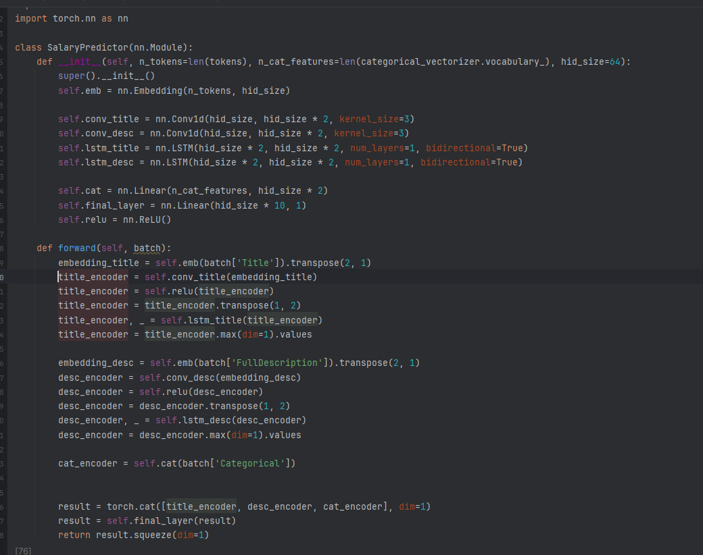

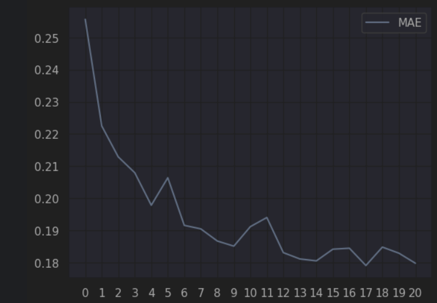

## Файл 2.ipynb
Тут есть dropout, batch norm, параллельные сверточные слои.
Результат стал хуже, но в 4.ipynb я это исправил

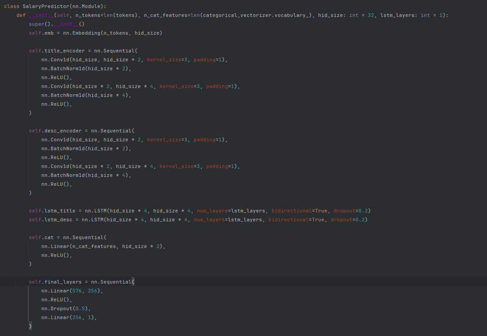
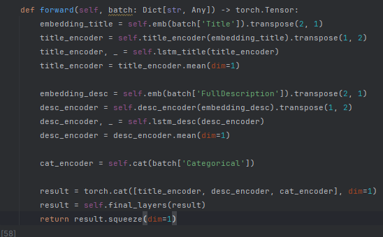
## Файл 3.ipynb
Здесь я пощупал пулинги. Я щупал их несколько, но ничего особо не дало результата.
Здесь привожу пример модели c AttentivePooling.

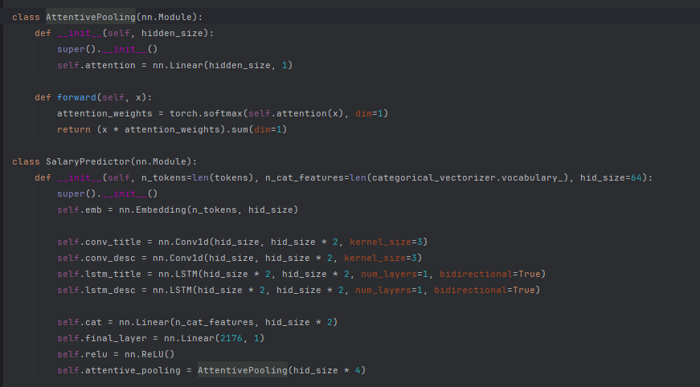
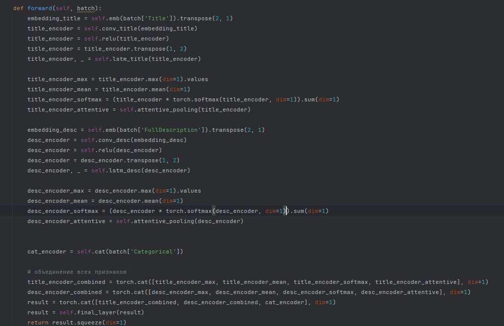

## Файл 4.ipynb
Самый лучший результат здесь.
Здесь (помимо того, что я использовал выше) я сделал акцент на сверточные слои.
Получилось за 25 эпох самый лучший неконечный результат (mae = 0.162)
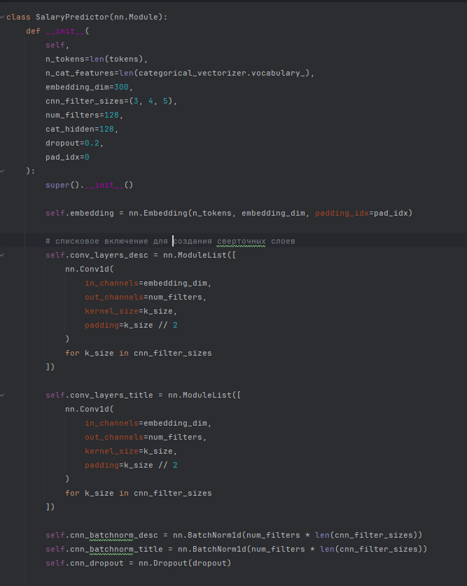
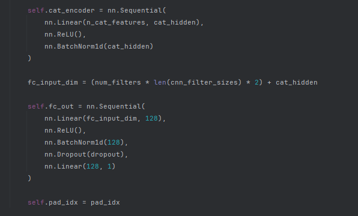
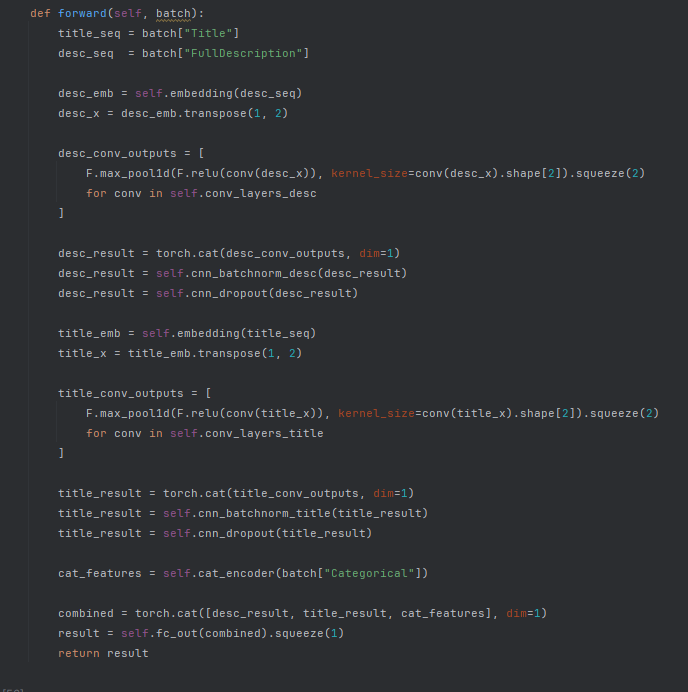

До конца модель не отработала, т.к. коллаб не позволяет в данный момент работать больше 2 часов, сколько бы я аккаунтов не создавал.
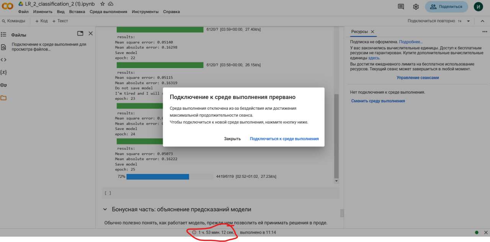

## Другие модели
Далее я пытался обучать еще модели, но аналогичная проблема -- коллаб не дает работать больше двух часов.
Писал по этому поводу в личку, но не получилось что-то с этим сделать

На ноутбуке на cpu одна эпоха идет от 12 минут, поэтому даже за ночь выходит по эпохам не больше чем в коллабе.
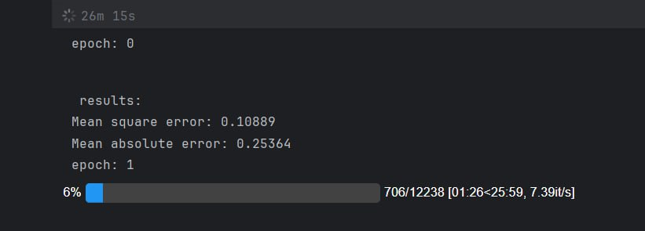

Лучший и до конца не реализовавшийся результат(4.ipynb) = 0.162